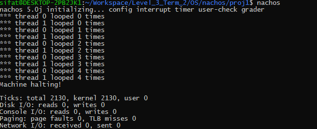

# Nachos Installation Guide

Normally, an operating system runs on the machine that it manages. Nachos is unusual in that the operating system runs "side-by-side" with the simulated machine.

## Installation Procedure of Nachos

I'm using WSL-2 in windows 10 and using Ubuntu 20.04 focal fosa as a subsystem of windows.
To install nachos follow these steps

- Install JDk
- Add gmake
- Download and extract nachos
- Add nachos to PATH
- Compile and run Nachos

### **Supplementary**

- Running nachos from Netbeans
- Installing MIPS Cross-compiler


### Install JDK

- Download the jdk 11 from:
  https://www.oracle.com/java/technologies/javase-jdk11-downloads.html  
  ``JDK 15 won't work``
- Extract the jdk you downloaded using this command
  
    ```
    tar zxvf jdk_file_name -C __folder-name___
    ```

- Check by going to that folder
- Set the jdk as default
  ```
    sudo update-alternatives --install /usr/bin/java java /usr/lib/jvm/ java-1.11.0-openjdk-amd64/bin/java 1800 

    sudo update-alternatives --install /usr/bin/javac javac /usr/lib/jvm/java-1.11.0-openjdk-amd64/bin/javac 1800
  ```
- TO test if the installation is complete or not. Type this two commands in the console
  ```
    java -version
    javac -version
  ```
### Add gmake
gmake is make for GNU systems. To work:
```
sudo ln -s /usr/bin/make /usr/bin/gmake
```

### Download and extract nachos
Download link: https://people.eecs.berkeley.edu/~kubitron/courses/cs162-F10/Nachos/nachos-java.tar.gz

Keep it somewhere.

Extract command:
```
gzcat nachos-java.tar.gz | tar xf -
```

### Add nachos to PATH
Go to the nachos directory (where you extracted nachos). Then, navigate to the bin directory and copy the path. We need to add that to our PATH variable.
- sudo gedit /etc/profile
- add this line to the end: export PATH=$PATH:___PATH_TO_NACHOS_BIN___
- logout and login (so that these take effect)

### Compile and run nachos
- cd to proj1 directory
- gmake
- Open the Makefile in nachos
- add the option '-Xlint' to the javac command
- cd to proj1 directory
- gmake
- nachos

``Remember run the ```nachos``` command from the proj1 directory.Only then it'll run if you follow the other steps correctly``

You should see something like this -


Congratulations! you've finished downloading and installing Nachos.

## Installing Cross Compile MIPS

To run nachos os , we need a cross compiler. In order to install cross compiler you have to do this following steps

- Download the cross compiler from https://inst.eecs.berkeley.edu/~cs162/fa13/Nachos/xgcc.html (download the Fall 2013,24MB file)
- Extract the mips compile file.
- Add the unzipped directory path to ARCHDIR and PATH. To do so, open /etc/profile
```
sudo nano /etc/profile
```
- Write down these two lines:
```
export ARCHDIR=path_to_mips_unzipped_directory
export PATH=$PATH:$ARCHDIR
```
- Login and Logout

Add these two lines below
```
sudo ln -s /usr/lib/x86_64-linux-gnu/libmpfr.so.6 /usr/lib/x86_64-linux-gnu/libmpfr.so.4
```
```
sudo ln -s /usr/lib/x86_64-linux-gnu/libgmp.so.10 /usr/lib/x86_64-linux-gnu/libgmp.so.3
```
Login and Logout (close the terminal and again open it)

**Go to the test folder in nachos directory and then run gmake command**
You should see something like this


After running this command you should see bunch of *.coff and *.c files.